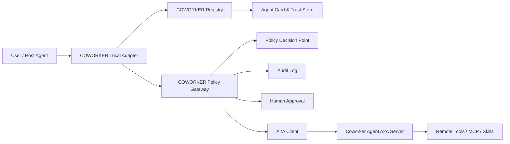
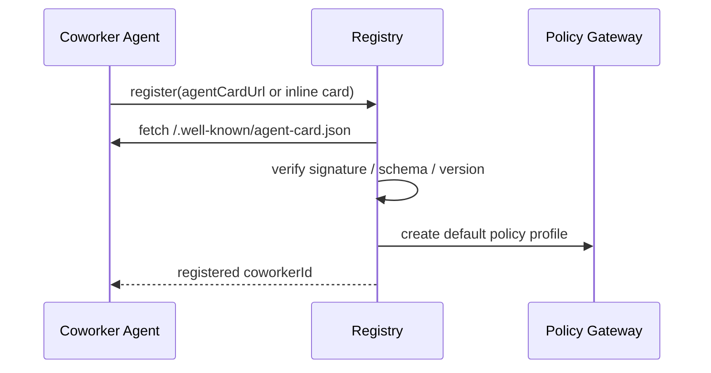
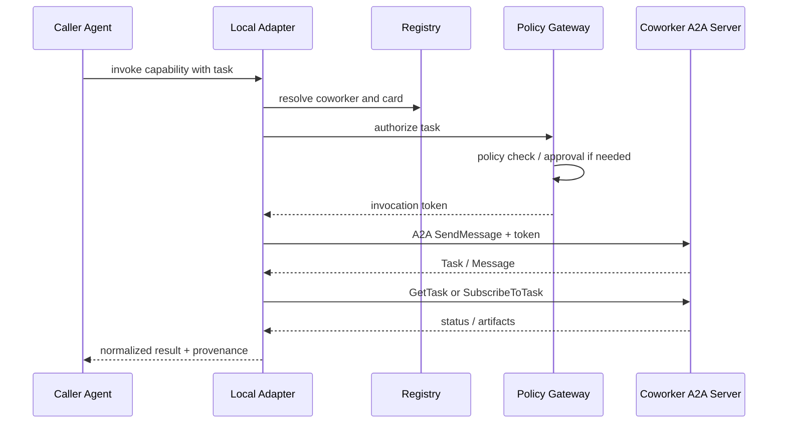

# COWORKER 设计方案 v1

调研日期：2026-07-03

## 1. 背景与结论

现有 Agent 的外部可复用能力通常有两类：

- SKILL：适合沉淀工作流、领域知识和本地脚本，但能力静态、安装分发成本较高，不适合实时协作。
- MCP：适合把工具、数据源、API 暴露给 Agent，但本质是“Agent 调工具”，不是“Agent 委托另一个 Agent 独立完成任务”。

COWORKER 要补的是第三类能力：当当前 Agent 能力不足时，把一个明确任务委托给另一个 Agent，并拿回结果、过程状态和可审计证据。它不是替代 SKILL/MCP，而是位于更高层的“Agent-to-Agent 协作层”。

推荐结论：

- 通信协议采用 A2A，COWORKER 不另造任务协议。
- COWORKER 自己定义注册中心、信任模型、授权策略和本地暴露方式。
- 安全上不能只依赖 Agent Card 的能力声明，必须引入“调用时能力令牌 + 策略网关 + 审计 + 人类审批”。
- MVP 先做本机/团队内可信注册中心，默认禁止外部副作用和私网访问，避免一开始就做开放互联网 Agent 市场。

## 2. 相关调研

### A2A 当前能力

A2A 已经提供了适合 COWORKER 的核心抽象：

- Agent Card：远程 Agent 的机器可读名片，描述身份、能力、技能、接口和认证要求。
- Task / Message / Part / Artifact：用于表达委托任务、消息轮次、输入输出片段和产物。
- Core Operations：包括 `SendMessage`、`SendStreamingMessage`、`GetTask`、`ListTasks`、`CancelTask`、`SubscribeToTask` 等。
- 多传输绑定：JSON-RPC、gRPC、HTTP/REST，可先选 JSON-RPC over HTTPS。
- 发现方式：`.well-known/agent-card.json`、注册表/目录、直接配置。
- 安全基础：TLS、认证、每次请求授权、Extended Agent Card、Agent Card JWS 签名、推送通知安全建议。

关键限制：

- A2A 只规定协议和基础安全要求，不规定统一授权模型。
- Agent Card 能描述“我有什么能力”，但不能保证“你本次只能让我做什么”。
- 多 Agent 委托链里的凭证传递、权限衰减、审计归因仍需要上层系统补齐。

### 安全风险

Agent-to-Agent 带来的主要风险不是协议本身，而是“把不确定的模型行为接到了真实系统权限上”：

- 权限过大：远程 COWORKER 可能继承调用方过宽的工具、文件、网络或凭证权限。
- 提示注入传播：远程 Agent 返回的文本可能诱导本地 Agent 调用敏感工具。
- 身份混淆：无法证明“是谁代表谁调用谁”，后续审计和追责困难。
- 委托链失控：A 调 B，B 再调 C，权限可能被放大或泄露。
- 数据外泄：任务上下文、文件、密钥、内部 URL 被发送给不可信 Agent。
- SSRF / Webhook 滥用：推送通知、文件 URL、回调地址可能访问本地或私网资源。
- 供应链风险：恶意或被劫持的 Agent Card 宣称安全能力，实际行为不可信。

## 3. COWORKER 定义

COWORKER 是一个被本地 Agent 识别、可发现、可授权、可调用、可审计的其他 Agent。

一个 Agent 可以同时扮演两个角色：

- Caller Agent：发现并调用 COWORKER。
- Coworker Agent：把自己注册到 COWORKER Registry，接受其他 Agent 的任务委托。

COWORKER 的最小条件：

- 暴露 A2A Server 接口。
- 提供 Agent Card。
- 在注册中心登记身份、能力、信任等级和策略约束。
- 接受 COWORKER 网关签发的短期调用令牌。
- 产出结构化任务结果和审计元数据。

## 4. 系统边界

COWORKER 平台负责：

- 注册：接收 Agent 自注册或管理员注册。
- 发现：让本地 Agent 按能力、标签、信任级别检索 COWORKER。
- 调用：通过 A2A 委托任务、查询状态、取消任务、订阅流式结果。
- 安全：身份验证、能力授权、策略判断、令牌衰减、审批、沙箱和审计。
- 适配：把 COWORKER 暴露成当前 Agent 可使用的本地工具，例如 MCP 工具或内置插件。

COWORKER 平台不负责：

- 定义模型推理方式。
- 管理远程 Agent 的内部工具实现。
- 保证不可信远程 Agent 一定诚实执行。
- 替代企业 IAM、密钥管理、数据分级系统。

## 5. 总体架构



核心分层：

- 控制面：注册中心、Agent Card 管理、健康检查、能力索引、信任等级。
- 数据面：A2A 消息、任务生命周期、流式输出、产物传输。
- 安全面：身份、授权、策略、调用令牌、审批、审计、撤销。
- 本地适配面：把 COWORKER 能力映射为当前 Agent 可调用的接口。

## 6. 组件设计

### 6.1 COWORKER Registry

职责：

- 保存 COWORKER 注册记录。
- 拉取或接收 Agent Card。
- 验证 Agent Card 签名、版本、缓存头和来源。
- 定期健康检查。
- 按能力、标签、输入输出类型、信任等级、风险等级检索。
- 管理禁用、吊销、灰度和版本变更。

注册方式：

- 本地注册：用户把本机某个 Agent 注册为 COWORKER。
- URL 注册：提供 Agent Card URL，例如 `https://host/.well-known/agent-card.json`。
- 组织注册：管理员把团队可信 Agent 加入目录。
- 临时注册：当前任务临时使用一次，任务结束自动过期。

注册记录示例：

```json
{
  "coworkerId": "coworker:team:code-reviewer",
  "displayName": "Code Reviewer",
  "agentCardUrl": "https://reviewer.example.com/.well-known/agent-card.json",
  "agentCardVersion": "1.2.0",
  "trustTier": "team-trusted",
  "status": "active",
  "owner": "team-platform",
  "allowedCallers": ["agent:local:codex", "group:devtools"],
  "riskCeiling": "R2",
  "registeredAt": "2026-07-03T00:00:00Z"
}
```

### 6.2 COWORKER Local Adapter

职责：

- 给当前 Agent 提供简单接口：搜索、选择、调用、查询状态、取消任务。
- 将自然语言任务封装成 A2A `Message`。
- 将返回的 A2A `Task` / `Artifact` 转成本地 Agent 可理解的结果。
- 对远程输出打上“不可信外部输入”标签，避免直接进入高权限工具链。

建议暴露为 MCP 工具集：

- `coworker.list`
- `coworker.search`
- `coworker.describe`
- `coworker.invoke`
- `coworker.get_task`
- `coworker.cancel_task`

这样当前 Agent 不需要直接知道每个远程 Agent 的 URL 和协议细节。

### 6.3 COWORKER Policy Gateway

所有调用必须经过网关。网关不做推理，只做确定性控制：

- 校验调用方身份。
- 校验目标 COWORKER 是否允许被调用。
- 根据任务、上下文、数据类型、风险等级做策略判断。
- 签发短期调用令牌。
- 执行脱敏、裁剪、文件隔离。
- 记录审计日志。
- 对高风险操作触发人类审批。

建议网关同时承担出站网络控制，禁止远程回调访问本机、私网和元数据地址。

### 6.4 Coworker Agent A2A Server

每个 COWORKER 暴露标准 A2A Server：

- Public Agent Card：公开基础能力，不含内部敏感信息。
- Extended Agent Card：认证后返回更细粒度能力、配额、限制。
- A2A Task API：处理任务、流式事件、取消、查询。
- Auth middleware：验证 COWORKER 调用令牌。
- Audit callback：返回执行摘要、工具调用摘要、产物哈希。

## 7. 能力模型

A2A 的 `skills` 主要表达自然语言能力。COWORKER 需要追加机器可执行的能力边界。

建议在 Agent Card 或 Extended Agent Card 中增加扩展字段 `x-coworker`：

```json
{
  "x-coworker": {
    "riskLevel": "R2",
    "delegation": {
      "canDelegate": false,
      "maxDepth": 0
    },
    "capabilities": [
      {
        "id": "code.review.readonly",
        "description": "Review provided code diff and return findings only.",
        "actions": ["analyze", "summarize"],
        "resources": ["provided_text", "provided_files"],
        "sideEffects": "none",
        "network": "none",
        "requiresApproval": false
      }
    ],
    "limits": {
      "maxInputBytes": 200000,
      "maxRuntimeSeconds": 300,
      "maxCostUsd": 1.0
    }
  }
}
```

风险等级建议：

- R0：纯推理，不读写外部资源。
- R1：读取公开资料或调用公开 API。
- R2：读取调用方显式提供的文件、文本、图片。
- R3：在隔离目录生成文件或补丁，不落地到真实项目。
- R4：对外部系统产生副作用，如发消息、建 PR、写数据库、调用业务 API。
- R5：接触密钥、生产系统、内网、部署、支付、删除、权限管理。

默认策略：

- R0-R2 可自动执行。
- R3 只允许写入沙箱，应用到真实工作区前需要调用方确认。
- R4 必须人类审批，并提供 dry-run / diff。
- R5 默认禁止，除非管理员显式授权、强身份认证、强审计。

## 8. 授权方案

仅靠“目标 Agent 自己说支持哪些安全方案”不够。COWORKER 应引入调用时授权令牌。

### 8.1 Invocation-Bound Capability Token

每次调用前由 Policy Gateway 签发短期令牌，令牌必须绑定：

- `iss`：COWORKER Registry / Gateway。
- `sub`：调用方 Agent 身份。
- `act`：代表的最终用户或上游 Agent。
- `aud`：目标 COWORKER。
- `task_id` / `context_id`：本次任务。
- `scope`：允许的能力 ID。
- `resources`：允许访问的数据范围。
- `risk_ceiling`：最高风险等级。
- `delegation_depth`：剩余可委托深度。
- `budget`：时间、金额、token、请求次数。
- `exp`：短有效期，建议 5-30 分钟。
- `provenance`：上游调用链摘要。

MVP 可用 JWS/JWT。后续如果要做多跳委托和策略衰减，可升级为 Biscuit / Macaroon / Zanzibar / Cedar 等表达能力更强的方案。

令牌示例：

```json
{
  "iss": "coworker-gateway.local",
  "sub": "agent:local:codex",
  "act": "user:l",
  "aud": "coworker:team:code-reviewer",
  "scope": ["code.review.readonly"],
  "resources": {
    "files": ["task://input/diff.patch"],
    "secrets": []
  },
  "risk_ceiling": "R2",
  "delegation_depth": 0,
  "budget": {
    "maxRuntimeSeconds": 300,
    "maxCostUsd": 1.0
  },
  "exp": 1783105800
}
```

### 8.2 委托链规则

如果允许 COWORKER 再调用其他 COWORKER：

- 每跳必须产生新的衰减令牌。
- 后一跳权限只能小于等于前一跳。
- `delegation_depth` 每跳减 1。
- 禁止把原始用户凭证传给下游。
- 审计链必须记录完整调用路径。
- 任一跳触达 R4/R5 时暂停并请求人类审批。

## 9. 数据安全

上下文最小化：

- 只发送完成任务必需的数据。
- 文件默认以快照副本或内容片段发送，不暴露真实路径。
- 密钥、环境变量、cookie、token、SSH key 永不进入任务上下文。
- 远程输出默认视为不可信输入，不能直接触发本地命令。

数据分级：

- Public：可发送给任意已注册 COWORKER。
- Internal：仅团队可信 COWORKER。
- Confidential：需要审批和脱敏。
- Secret：禁止发送。

产物处理：

- 远程产物先落入隔离区。
- 对可执行文件、脚本、补丁做静态检查。
- 应用补丁、运行脚本、上传文件都必须由本地 Agent 再次经过策略判断。

## 10. 调用流程

### 10.1 注册流程



### 10.2 调用流程



## 11. 策略示例

```yaml
policies:
  - id: readonly-code-review
    callers:
      - agent:local:codex
    coworkers:
      - coworker:team:code-reviewer
    allow:
      scopes:
        - code.review.readonly
      risk_ceiling: R2
      resources:
        files:
          source: provided_only
        secrets: none
      network:
        outbound: none
      delegation:
        max_depth: 0
    approval:
      required: false

  - id: external-side-effect
    allow:
      risk_ceiling: R4
    approval:
      required: true
      require_dry_run: true
      approvers:
        - user:owner
```

## 12. MVP 建议

第一版只做“安全可用的最小闭环”：

- 本地 Registry：SQLite 或单 JSON 文件保存注册记录。
- A2A JSON-RPC Client：支持 `SendMessage`、`GetTask`、`CancelTask`。
- Public Agent Card 拉取与缓存：支持 `.well-known/agent-card.json`。
- 本地 MCP Adapter：把 COWORKER 暴露给宿主 Agent。
- JWT 调用令牌：短期、audience-bound、scope-bound。
- 策略 YAML：按 caller、coworker、scope、risk 做 allow/deny。
- 审计日志：JSONL，记录调用链、输入摘要、输出摘要、产物哈希。
- 安全默认值：禁止委托链，禁止私网回调，禁止 Secret 传递，R4 以上审批。

MVP 暂不做：

- 开放互联网 Agent 市场。
- 自动信任未知 Agent。
- 多组织联邦注册。
- 复杂计费与配额。
- 自动把远程补丁应用到真实工作区。

## 13. 后续路线

阶段 1：本地协作

- CLI：`coworker register/list/invoke/revoke`。
- 本地 Agent 自注册。
- A2A 基础调用。
- JSONL 审计。

阶段 2：团队目录

- 组织级 Registry。
- OIDC / mTLS 身份。
- Extended Agent Card。
- 管理员策略模板。
- 人类审批 UI。

阶段 3：委托链与联邦

- 多跳衰减令牌。
- 跨团队信任锚。
- Agent Card 签名强校验和吊销列表。
- 细粒度数据分级与 DLP。

阶段 4：生态化

- COWORKER 市场或目录。
- 能力评测、信誉评分、SLA、成本模型。
- 标准化 `x-coworker` 扩展。

## 14. 开放问题

- COWORKER 是只服务本机 Agent，还是要服务团队内所有 Agent？
- 当前宿主 Agent 是否已经支持 MCP？如果支持，MVP 可以优先做 MCP Adapter。
- 是否要求 COWORKER 能访问本地文件？如果要，必须先定义文件沙箱和数据分级。
- 是否允许 COWORKER 再调用其他 COWORKER？建议 MVP 禁止。
- 审批体验放在哪里：CLI、桌面端、Web Console，还是宿主 Agent 原生 UI？

## 15. 参考资料

- A2A Specification: https://github.com/a2aproject/A2A/blob/main/docs/specification.md
- A2A Agent Card concept: https://agent2agent.info/docs/concepts/agentcard/
- Google A2A announcement: https://developers.googleblog.com/en/a2a-a-new-era-of-agent-interoperability/
- Linux Foundation A2A project announcement: https://www.linuxfoundation.org/press/linux-foundation-launches-the-agent2agent-protocol-project-to-enable-secure-intelligent-communication-between-ai-agents
- IBM A2A overview and MCP comparison: https://www.ibm.com/think/topics/agent2agent-protocol
- OWASP Top 10 for Agentic Applications 2026: https://genai.owasp.org/resource/owasp-top-10-for-agentic-applications-for-2026/
- OWASP LLM Prompt Injection: https://genai.owasp.org/llmrisk/llm01-prompt-injection/
- OWASP LLM Excessive Agency: https://genai.owasp.org/llmrisk/llm06-sensitive-information-disclosure/
- NIST AI Agent Standards Initiative: https://www.nist.gov/artificial-intelligence/ai-agent-standards-initiative
